# Homework #5 Solution
**Shiva Pathruni**

**NetID: gu9436**

----
## Question1 : Install Node.js/NPM, version number, set up directory create package.json, install commonmark, run commonmark from command line with node.js

### (a)

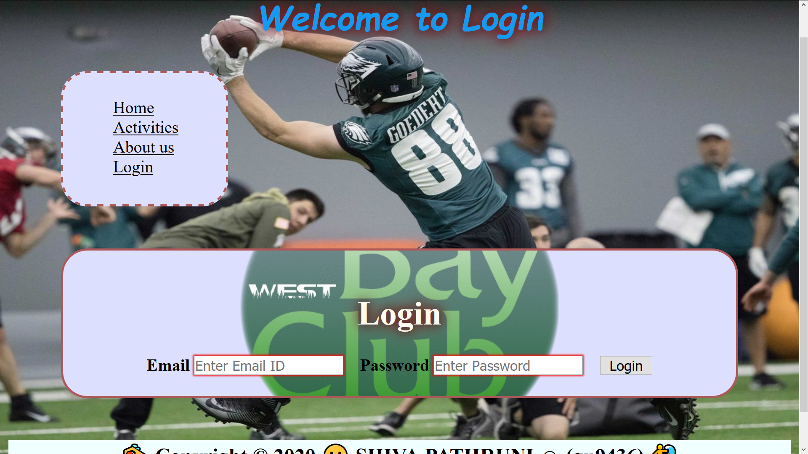  

### (b) 

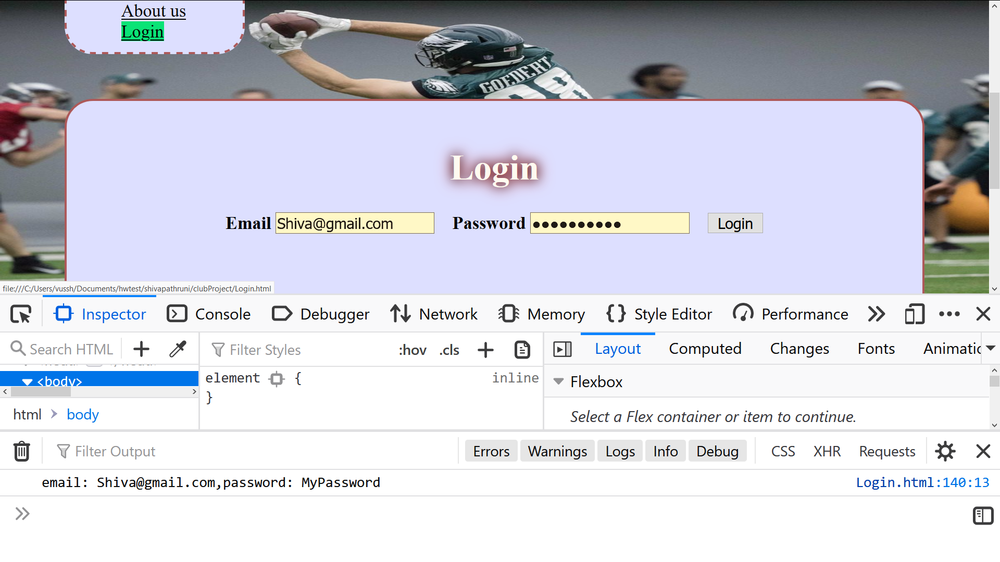

----
## Question2 : Bundler Installation and Use

### (a)

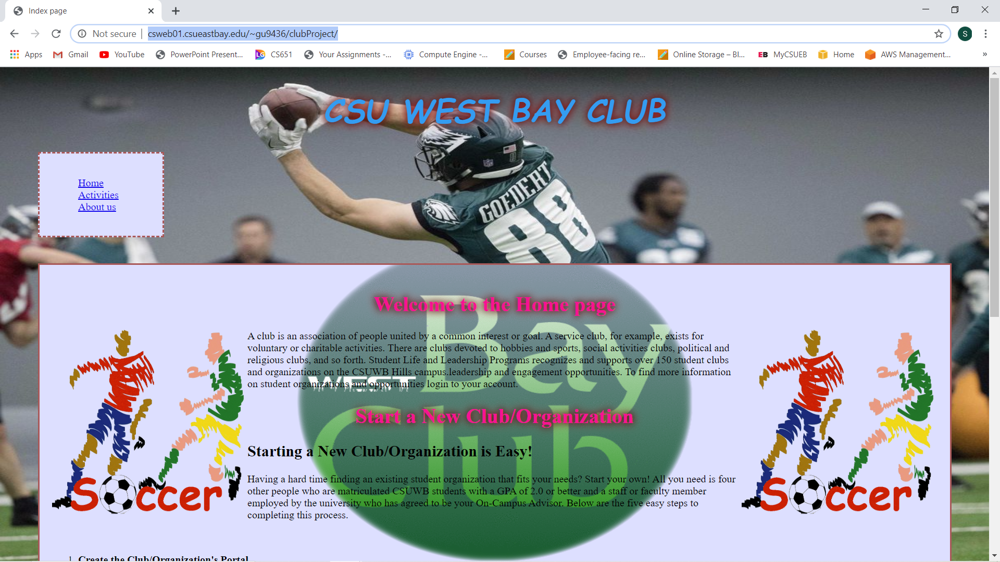

### (b)

***Update your club activity page. Used table here.***

### (c)

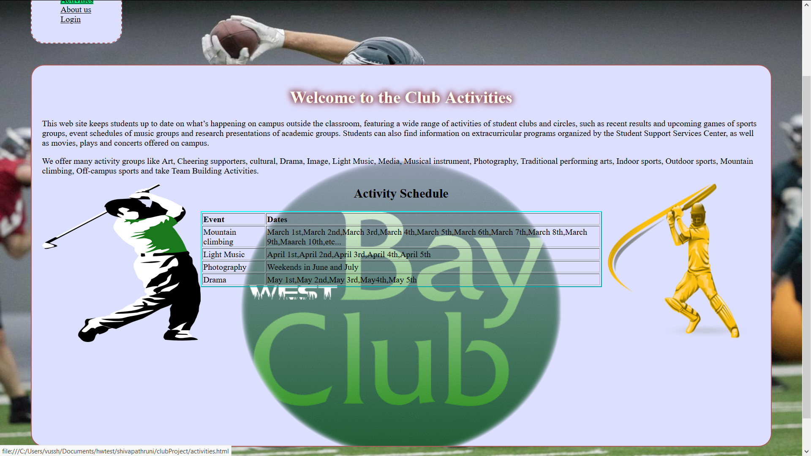

----
## Question 3: Using Modules

### (a)

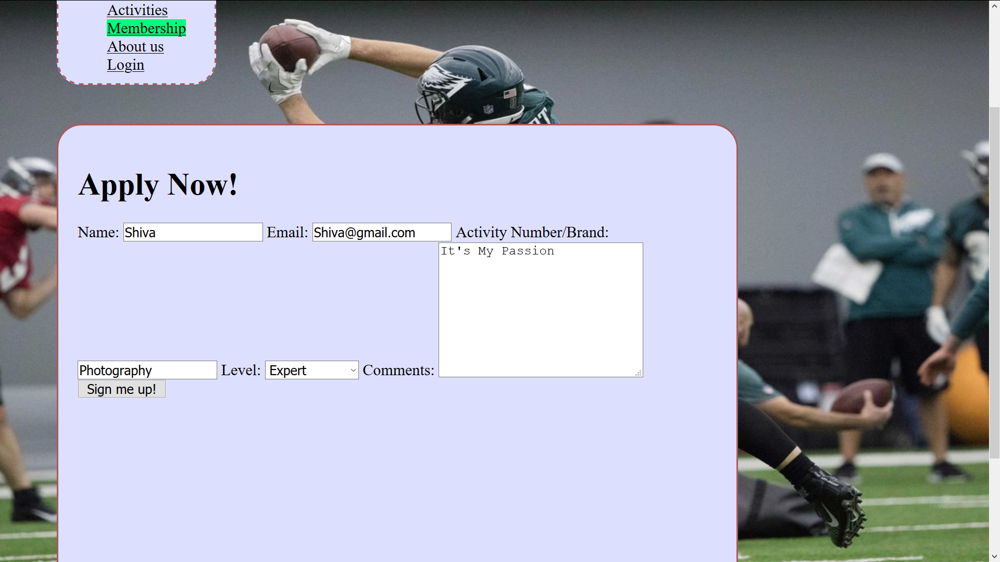

### (b)

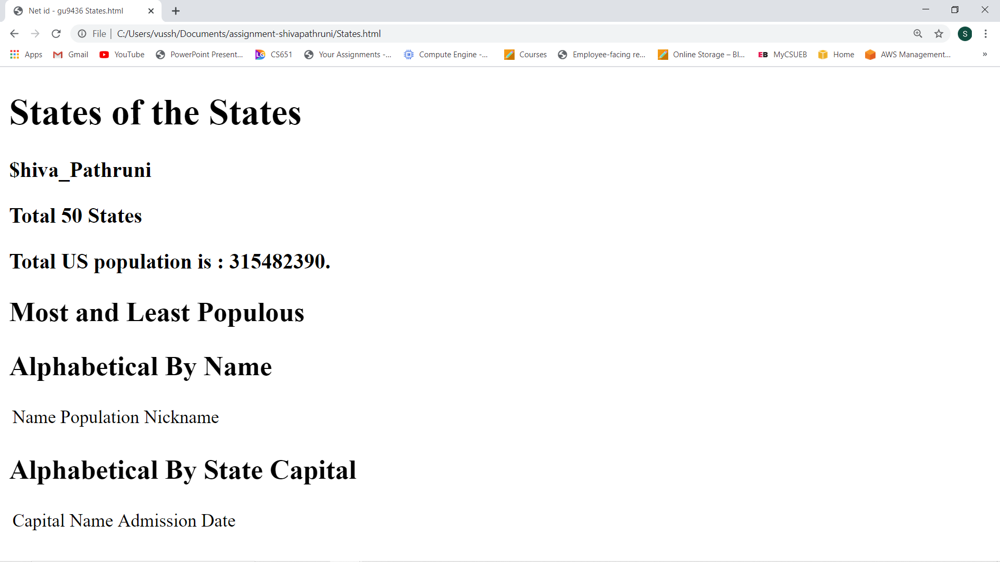

### (c)

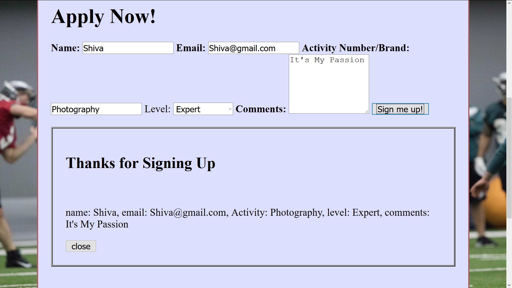

### (d)

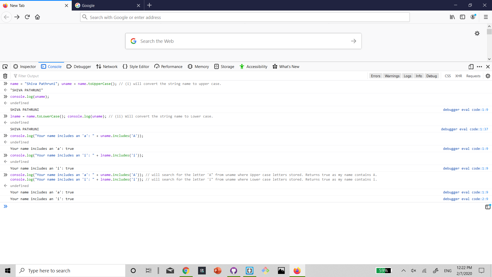

----
## Question 4: More Modules and Deployment

### (a)

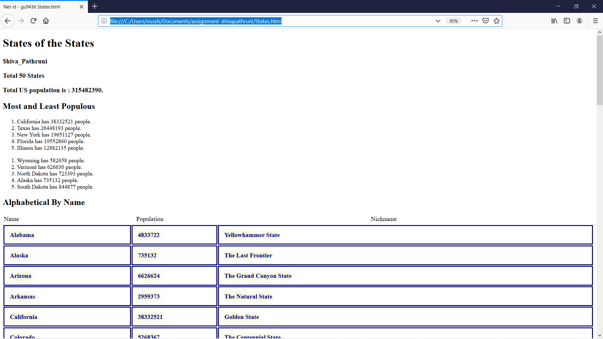

### (b)

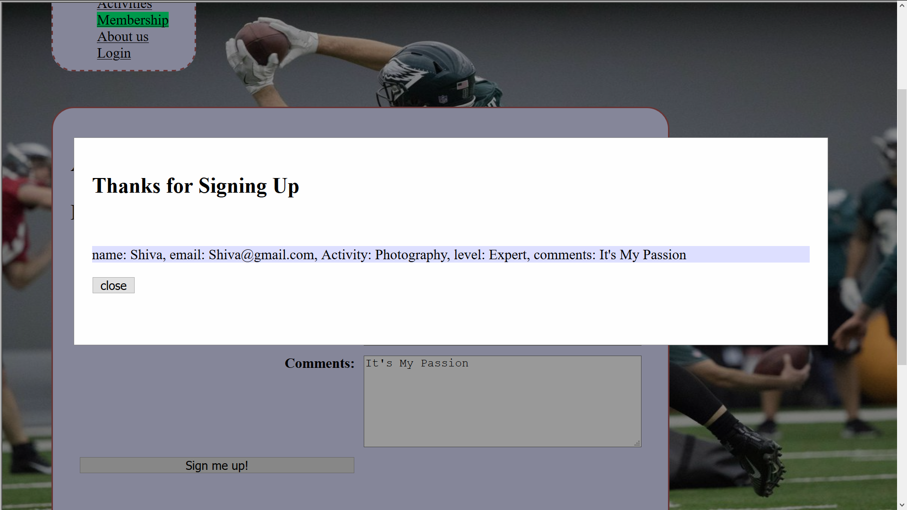

### (c)

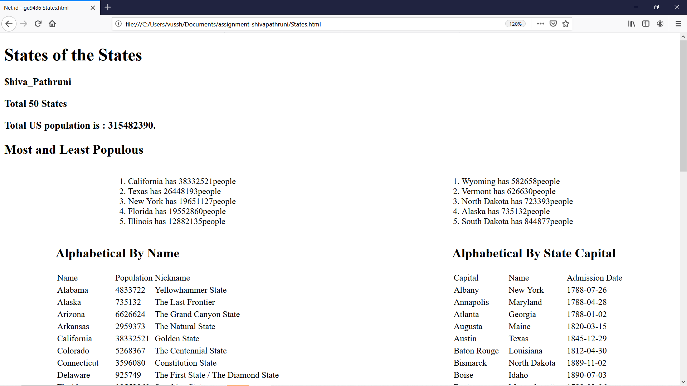

### (d)

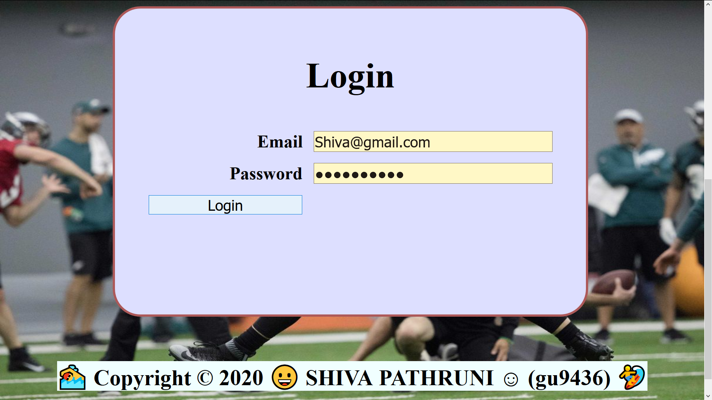
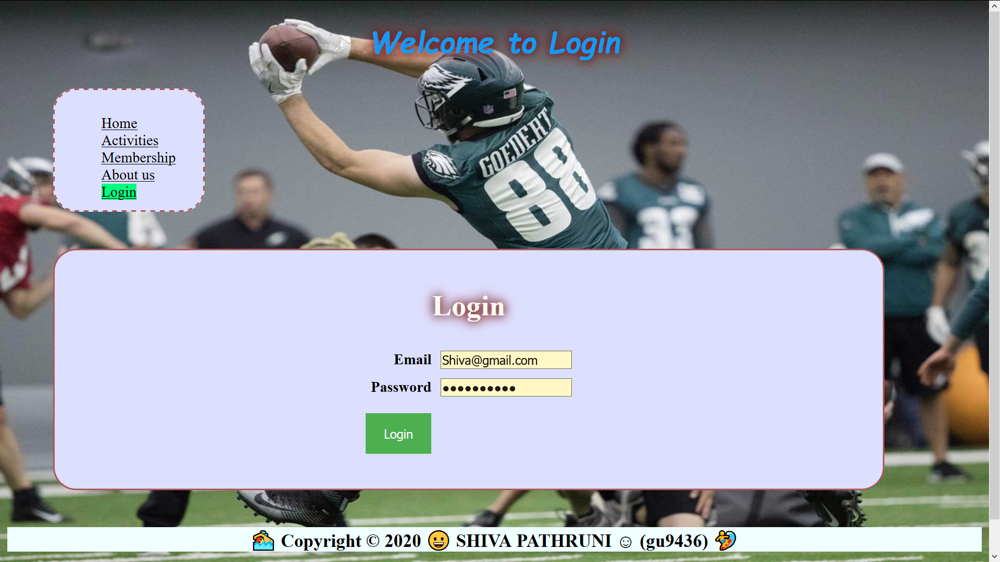
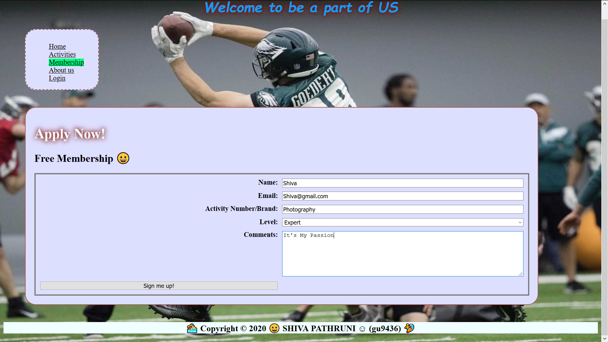

----
## Question 5: React Intro, JSON data

----
----

