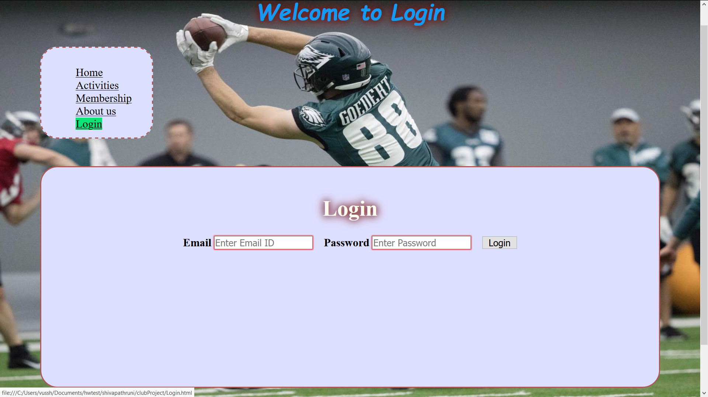

# Homework #4 Solution
**Shiva Pathruni**

**NetID: gu9436**

----
## Question1 : Login form & DOM events

### (a)

  

### (b) 


----
## Question2 : Club Events from JavaScript Data

### (a)
```
events = [{"name": "Mountain climbing",
           "dates": ["March 1st", "March 2nd", "March 3rd", "March 4th", "March 5th", "March 6th", "March 7th", "March 8th", "March 9th", "Maarch 10th", "etc..."]},
         {"name": "Light Music",
          "dates": ["April 1st", "April 2nd", "April 3rd", "April 4th", "April 5th"]},
         {"name": "Photography", "dates": ["Weekends in June and July"]},
         {"name": "Drama",
          "dates": ["May 1st", "May 2nd", "May 3rd", "May4th", "May 5th"]}
         ];
```


### (b)


### (c)
```
window.onload = function()    {
        let table_body= document.getElementById("act_section_main").getElementsByTagName("table")[0].getElementsByTagName("tbody")[0];        
        tableresult=events.map(function (s) { 
        return "<tr>"+"<td>"+s.name+"<td>"+s.dates+"</tr>";
        }).join('');
        
        table_body.innerHTML=tableresult;
    }
```


----
## Question 3: Club Application Form, DOM events

### (a)


### (b)


### (c)


### (d)


----
## Question 4: CSS Styling

### (a)


### (b)


### (c)


### (d)


----
## Question 5: Deployment

**Answer5**

Testing done and every thing works fine.<br/>
Please use the below link to access my site **http://csweb01.csueastbay.edu/~gu9436/clubProject/**


----
----


