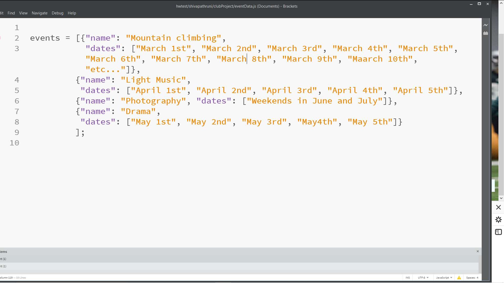

# Homework #1 Solution

**Student Name**:  Shiva Pathruni

**NetID**: gu9436

## Question 1    

### (a)


### (b)


## Question 2

### (a)



### (b)


### (c)


## Question 3

### (a)

.

### (b)

.


## Question 4

### (a)

**Answer4a: Ordered list**

Programming languages:

  1. HTML
  2. C
  3. C++

### (b)

**Answer4b: Bullet list**

Operating systems:

  * Windows
  * mac
  * linux
  
### (c)

**Answer4c: Bullet list**

IDEs:

  * Eclipse
  * Netbeans
  * Ruby Mine

## Question 5

### (a)

**Written HTML and highlighted using Markdown mechanism**

```html
<h1>Heading</h1>

<h2>Sub-heading</h2>

<p>Paragraphs are separated
by a blank line.</p>

<p>Two spaces at the end of a line<br />
produces a line break.</p>

<p>Text attributes <em>italic</em>, 
<strong>bold</strong>, <code>monospace</code>.</p>

<p>Horizontal rule:</p>

<hr />

<p>Strikethrough:</p>
<strike>strikethrough</strike>
```

### (b)


[Link to Brackets fetching a local file](https://github.com/CSUEB-DrB-CS/assignment-shivapathruni/blob/master/linksample/README.md)

[or]

[Link to Brackets routed to a web site ](http://brackets.io/)


