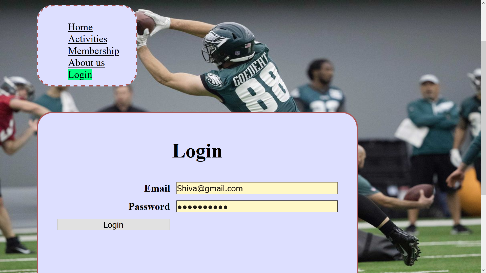

# Homework #2 Solution
**Shiva Pathruni**

**NetID: gu9436**

----
## Question1 : HTML & CSS Review

### (a)

```
<nav class="navbar navbar-expand-sm navbar-dark bg-dark sticky-top">
  <a class="navbar-brand d-none d-md-block" href="#">
    
  </a>
</nav>
```
**Answer:**

**list of tags:**         nav, a, img

**list of attributes:**   class, alt, src, style
     
### (b)

*We cannot have same id attribute on more than one element in an HTML document as id attribute specifies a unique id for an HTML element and also using it is a bad practice.

*Because we use id attributes as targets for links within a page and  to manipulate the element with the specific id using javascript.

*We can use same class on multiple elements in a document.

*Why because assigning the same class to multiple elements on the page will share the class style across those elements while giving you the ability to control the class properties from one single spot, meaning that if you change one of the class properties this will extend to all elements sharing that specific class.

### (c)

```
body {
  padding-bottom: 50px;
}

#RelatedItems {
  max-height: 50vh;
  overflow-y: auto;
}

.graphDrawing {
  border: dashed thin #808080;
  border-radius: 5px;
  width: 90%;
  margin: 0;
  margin-bottom: 25px;
}
```

**Answer:**

**CSS selector:** body(TYPE SELECTOR), RelatedItems(ID SELECTOR), graphDrawing(CLASS SELECTOR)

**CSS properties:** max-height, overflow-y, border, border-radius, width, margin, margin-bottom

**CSS values:** 50vh, auto, dashed thin #808080, 5px, 90%, 0, 25px


### (d)

```
article figcaption {
  font-size: 18px;
  text-align: center;
}

a.navbar-brand img {
  position: absolute;
  top: 0px;
  left: 0px;
  background-color: white;
  margin-right: 10px;
  padding: 3px;
  border-right-color: #D4D4D4;
  border-right-style: solid;
  border-right-width: 1px;
  box-shadow: 0 1px 4px rgba(0, 0, 0, 0.067);
}
```

**Answer:**

There are four different combinators in CSS: descendant selector(space), child selector(>), adjacent sibling selector(+), general sibling selector(~)

"article figcaption" , "a.navbar-brand img" used **descendant combinator** as decendent combinator use a space between any two selectors.

In the above CSS fragments we combined two selectors such that elements matched by the second selector are selected if they have an ancestor (parent, parent's parent, parent's parent's parent, etc) element matching the first selector.


----
## Question2 : “Outline” pages/components for your club web app. We will start with an HTML page per “component”. We’ll learn what components are later.

### (a)

Created directory "clubProject" within the top level of my repo hw2

### (b)

Created “home page” (index.html), “about page” and a “club activities page”.<br/>
Added a `<main>` element to the `<body>` of all the 3 pages.<br/>
Added unique `<title>` in the `<head>` and placed some content for heading and paragraph in `<main>` element.<br/><br/>
(i) No, we shouldn't put site wide navigation into the `<main>` element. <br/>
(ii) No, we shouldn't put common banners (e.g., site logo) in the `<main>` element. <br/>
(iii) No, we shouldn't put copyright notices in the `<main>` element.

**File Names**

    * index.html
    * about.html
    * activities.html

### (c)

We should put the `<header>` element outside the `<main>` element according to the specification.<br/>
When a `<header>` element’s nearest ancestor sectioning root element is the `<body>` element, and it is not a descendant of the `<main>` element or a sectioning content element, then that `<header>` is scoped to the `<body>` element and represents introductory content for the page as a whole.<br/>
Added header to the files under clubProject directory.<br/> 

### (d)

No , We shouldn't put the `<footer>` element in `<main>` element according to the specification. Last item in the `<body>` is `<footer>` <br/>
When a `<footer>` element’s nearest ancestor sectioning root element is the `<body>` element, and it is not a descendant of the `<main>` element or a sectioning content element, then that `<footer>` is scoped to the `<body>` element and represents a footer for the page as a whole.<br/>
Added footer to all the pages under clubProject directory.<br/>

### (e)

Created a "navigation menu" for all the pages 


### (f)

HTML code for "about.html" page
```
<html>
	<head>
		<title>
		about page
		</title>
	</head>
	<body>
        <header>
            <h1 align=center>CLUB PROJECT</h1>
        <nav>
            <ul>
                <li><a href="/index.html">Home</a></li>
                <li><a href="/activities.html">Activities</a></li>
                <li class="active"><a href="/about.html">About us</a></li>
            </ul>
        </nav>    
        </header>
		<main>
            <h1 align=center> About us </h1>
            <p> Historically, clubs occurred in all ancient states of which we have detailed knowledge. Once people started living together in larger groups, there was need for people with a common interest to be able to associate despite having no ties of kinship. Organizations of the sort have existed for many years, as evidenced by Ancient Greek clubs and associations (collegia) in Ancient Rome. </P>
		</main>
        <footer>
            <br><br><br>            
            <P> Copyright © 2020 SHIVA PATHRUNI (gu9436) </P>
        </footer>
	</body>
</html>
```


----
## Question 3: JavaScript Review: strings and numbers, conversions, hex and binary. MDN string string manipulation methods.

### (a)


### (b)


### (c)


### (d)


### (e)


----
## Question 4: JavaScript Review: Arrays and basic Objects. MDN Array

### (a)


### (b)

```
sentence2 = "Whereas recognition of the inherent dignity and of the equal and inalienable rights of all members of the human family is the foundation of freedom, justice and peace in the world";
myArray2 = sentence2.split(" "); 

function upper(xString) { // (i) This function will convert the elements list in the array xString to uppercase and return back the array to the called function. 
  return xString.toUpperCase();
}

myArray3 = myArray2.map(upper); // (ii) The map() method creates a new array populated with the results of calling a provided function on every element in the calling array. Resulted array will be moved to myArray3 in uppercase.

function noCaseSort(x, y) {
  if (x.toLowerCase() < y.toLowerCase()) { // (iii) To compare each element in lower case till the array list is sorted completely.
    return -1;
  } else {
    return 1;
  }
  return 0;
}

myArray2.sort(noCaseSort);
// (iv) To The sort() method sorts the elements of an array in place and returns the sorted array. It will call the  function noCaseSort(x, y) and resulted sorted array will be stored in myArray2.
```


### (c)

```
me = {}; // creates an empty object
me.name = "Shiva Pathruni";
me["favorite desert"] = "Ice Cream";
// (i) The field "favorite desert" has two strings which couldn't be accepted to use with syntax ' object.fieldname ' for assigning or accessing a value.So we have used the syntax ' object["fieldname"] '.
me.courses = ["CS651", "CS311"];
// (ii) Yes, we can put an array in an object.
me.major = "Computer science";
me.number = 9436; // (iii) My number is 51
me.codeEditors = ["Brackets", "Notepad++", "Atom"]; // (iv) I too  use the same
me["nick name"] = "Sid";
console.log(me);
```




----
## Question 5: Initial styling for your club app. Create a stylesheet named club.css and put it in the top level of your clubProject directory. Link it in the `<head>` of all your site files.

### (a)


### (b)


### (c)


### (d)


----
----


@@@@@@@@@@@@@@@@@@@@@@@@@@@@@@@@@@@@@@@@@@@@@@@@@@@@@@@@@@@@@@@@@@@@@@@@@@@@@@@@@@@@@@@@@@@@@@@@@@@@@@@@@@@@@@@@@@


# shivapathruni

sid repo

@@@@@@@@@@@@@@@@@@@@@@@@@@@@@@@@@@@@@@@@@@@@@@@@@@@@@@@@@@@@@@@@@@@@@@@@@@@@@@@@@@@@@@@@@@@@@@@@@@@@@@@@@@@@@@@@@@
@@@@@@@@@@@@@@@@@@@@@@@@@@@@@@@@@@@@@@@@@@@@@@@@@@@@@@@@@@@@@@@@@@@@@@@@@@@@@@@@@@@@@@@@@@@@@@@@@@@@@@@@@@@@@@@@@@
@@@@@@@@@@@@@@@@@@@@@@@@@@@@@@@@@@@@@@@@@@@@@@@@@@@@@@@@@@@@@@@@@@@@@@@@@@@@@@@@@@@@@@@@@@@@@@@@@@@@@@@@@@@@@@@@@@

Made with ♥ and JavaScript [Brackets](https://en.wikipedia.org/wiki/Brackets_(text_editor)) is an open-source project, supported by an active and passionate community. It's made by other web developers like you! Learn How to Contribute…

[Link to Brackets fetching a local file](https://github.com/CSUEB-DrB-CS/assignment-shivapathruni/blob/master/linksample/README.md)

[or]

[Link to Brackets routed to a web site ](http://brackets.io/)


@@@@@@@@@@@@@@@@@@@@@@@@@@@@@@@@@@@@@@@@@@@@@@@@@@@@@@@@@@@@@@@@@@@@@@@@@@@@@@@@@@@@@@@@@@@@@@@@@@@@@@@@@@@@@@@@@@

**Written using markdown syntax**


Heading

Sub-heading
=

Paragraphs are separated
by a blank line.

Two spaces at the end of a line  
produces a line break.

Text attributes _italic_, 
**bold**, `monospace`.

Horizontal rule:

---

Strikethrough:
~~strikethrough~~


-------
-------

**Written using HTML**

```html
<h1>Heading</h1>

<h2>Sub-heading</h2>

<p>Paragraphs are separated
by a blank line.</p>

<p>Two spaces at the end of a line<br />
produces a line break.</p>

<p>Text attributes <em>italic</em>, 
<strong>bold</strong>, <code>monospace</code>.</p>

<p>Horizontal rule:</p>

<hr />

<p>Strikethrough:</p>
<strike>strikethrough</strike>
```

-------
-------

**Written C code with markdown**

**#include <stdio.h>**

**int** main() {    

   **int** number1, number2, sum;
    
   **printf**("Enter two integers: ");
   
   **scanf**("%d %d", &number1, &number2);
   
    // calculating sum
    
    sum = number1 + number2;      
    
   **printf**("%d + %d = %d", number1, number2, sum);
   
   **return** 0;
   
}


@@@@@@@@@@@@@@@@@@@@@@@@@@@@@@@@@@@@@@@@@@@@@@@@@@@@@@@@@@@@@@@@@@@@@@@@@@@@@@@@@@@@@@@@@@@@@@@@@@@@@@@@@@@@@@@@@@

Bullet list:

  * apples
  * oranges
  * pears

Numbered list:

  1. lather
  2. rinse
  3. repeat

An [example](http://example.com).

solution stuff here 


